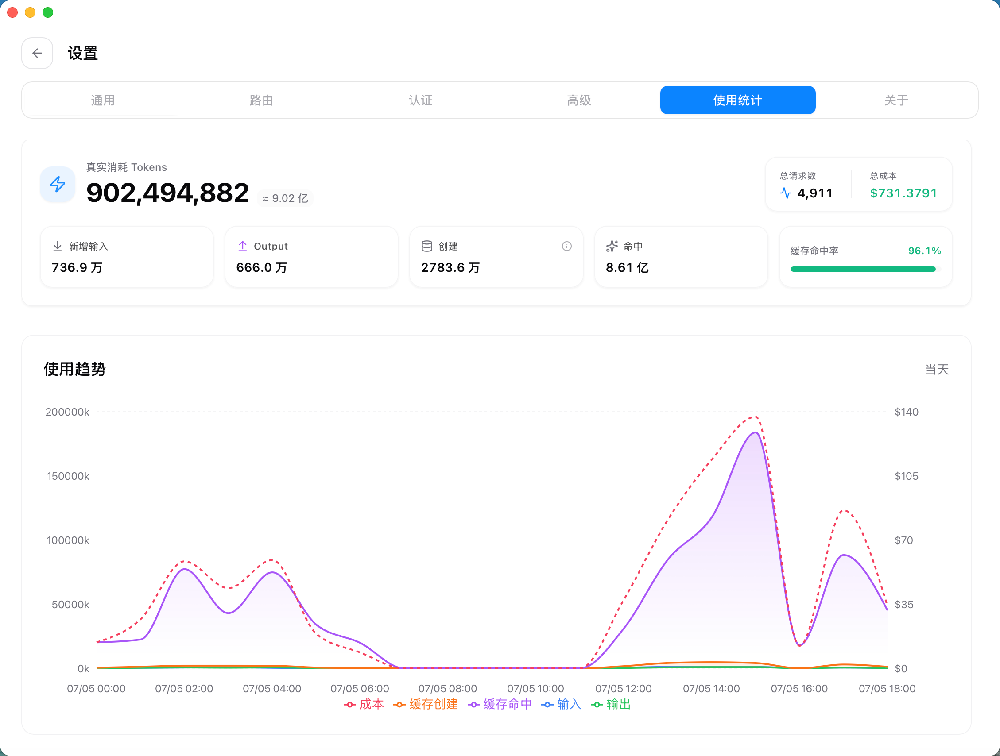
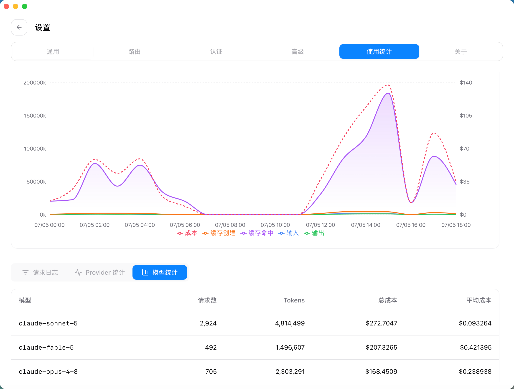
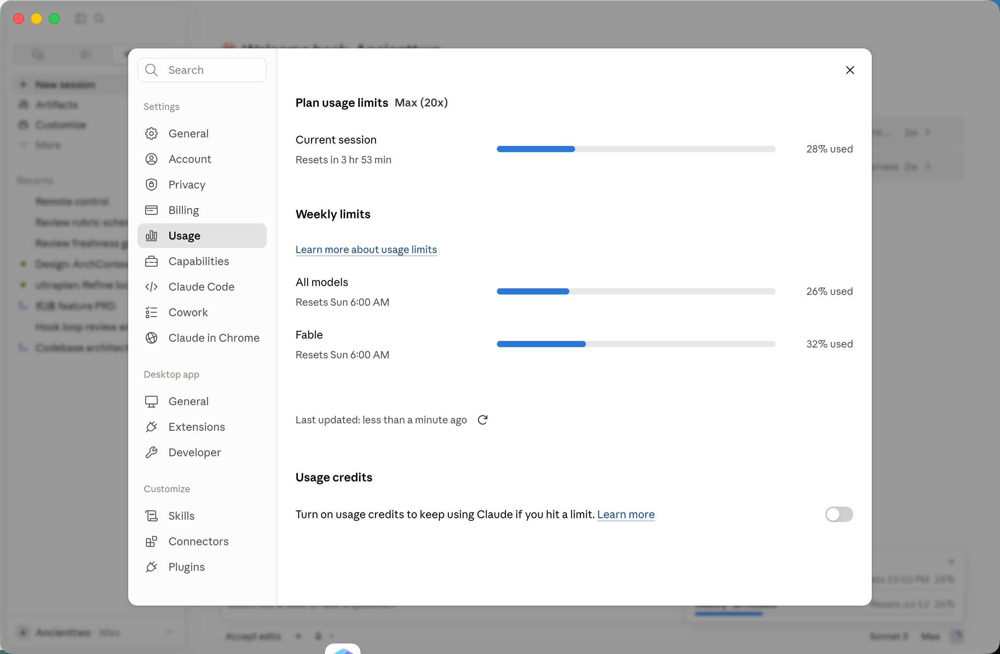

# Fable-agents

**English** · [简体中文](README.zh-CN.md)

Portable installer for a three-layer Claude Code model-routing setup: a **Fable 5** orchestrator that only plans, delegates, and synthesizes, plus three subagents (**deep-reasoner** on Opus, **fast-worker** on Sonnet, and **gatekeeper** on Opus as the acceptance and ship gate) and **Codex** as an independent peer engineer.

## Why route

One Max (20x) subscription, one day of heavy multi-agent work (2026-07-05): **902M tokens** across **4,911 requests** at a **96.1% cache-hit rate** — **$731** in API-equivalent usage.



The request split is the routing contract at work: Fable answered only **492 requests (10%)** — pure orchestration: plan, delegate, judge, synthesize. Sonnet carried **2,924 execution requests**; Opus took **705** judgment and gate runs.



Fable bills against its own weekly pool, separate from the all-models pool. With Fable doing orchestration only, the two pools drain in step — **32% Fable vs 26% all-models** mid-week. A single model's weekly usage keeps pace with the rest of the subscription combined, instead of the Fable pool burning out on execution work while the shared pool idles.



## Install

### Option A — clone and run

```bash
git clone https://github.com/Ancienttwo/Fable-agents.git
cd Fable-agents
bash scripts/install.sh --project /path/to/your/project
```

Run without `--project` to target the current directory. The script is idempotent — safe to re-run.

Flags:
- `--project <dir>` — target project root (default: cwd)
- `--skip-plugin` — skip installing/checking the Codex plugin
- `--skip-smoke` — skip the headless agent smoke test (use in sandboxes without API credentials)

### Option B — send to your Claude

Paste this to any Claude that can run commands on your machine (Claude Code CLI, desktop app, or IDE extension):

> Install the model-routing setup from https://github.com/Ancienttwo/Fable-agents — clone the repo, run `bash scripts/install.sh --project <path-to-my-project>`, then report the per-layer results (`[new]`/`[ok]`/`[conflict]`/`[warn]`). Never overwrite anything on `[conflict]`.

## What it installs

1. `.claude/agents/fast-worker.md`, `.claude/agents/deep-reasoner.md`, and `.claude/agents/gatekeeper.md` into the target project
2. The `## Model Routing Hierarchy` section into your global `CLAUDE.md` (`$CLAUDE_CONFIG_DIR/CLAUDE.md`, default `~/.claude/CLAUDE.md`)
3. The `codex@openai-codex` plugin (marketplace `openai/codex-plugin-cc`), with a readiness check
4. A headless smoke test confirming all three agents respond

The installer never overwrites a file that differs from the bundled version — it reports `[conflict]` and exits `3` instead, so you can diff and decide.

## The routing model

- **Fable 5 (main loop) = orchestrator.** Plans, delegates, synthesizes. Never does execution work inline.
- **Subagents always carry an explicit model/type.** No spawn — Agent tool or Workflow — may silently inherit Fable.
- **`deep-reasoner`** (Opus, `effort: max`) — architecture research, hard reasoning, high-risk judgment calls. Recommends; the orchestrator confirms the final framework.
- **`fast-worker`** (Sonnet, `effort: max`) — implementation, tests, refactors, docs, mechanical execution.
- **`gatekeeper`** (Opus, `effort: max`) — last gate after execution subagents deliver: reviews the diff against the goal, runs the project's real verification, and returns a `PASS`/`FAIL`/`BLOCKED` ship recommendation. Advises, never decides — ship actions run only on the orchestrator's explicit execution order; never fixes code.
- **Codex** — independent peer engineer, not a mandatory reviewer. Invoked via the `codex` plugin's `/codex:*` commands or `codex exec`.
- **High-stakes decisions run dual-track:** deep-reasoner and Codex each produce a solution independently; the orchestrator compares and synthesizes rather than picking one.

## Structure

```
SKILL.md                          Claude Code skill manifest (usable as a skill if this repo
                                   is placed/symlinked under ~/.claude/skills/)
assets/deep-reasoner.md           Agent definition installed into target projects
assets/fast-worker.md             Agent definition installed into target projects
assets/gatekeeper.md              Agent definition installed into target projects
assets/model-routing-hierarchy.md Source of the CLAUDE.md section the installer appends
scripts/install.sh                Idempotent installer (see flags above)
```

## Prerequisites

- Claude Code CLI (`claude`) on PATH for the plugin step and smoke tests
- `node` for the Codex readiness check
- `codex` CLI + `codex login` for a fully verified Codex layer (optional — reported as `[warn]` if missing, not a hard failure)

An already-running interactive Claude Code session loads agent types at startup, so it won't see newly installed agents until restart or `/reload-plugins`.
